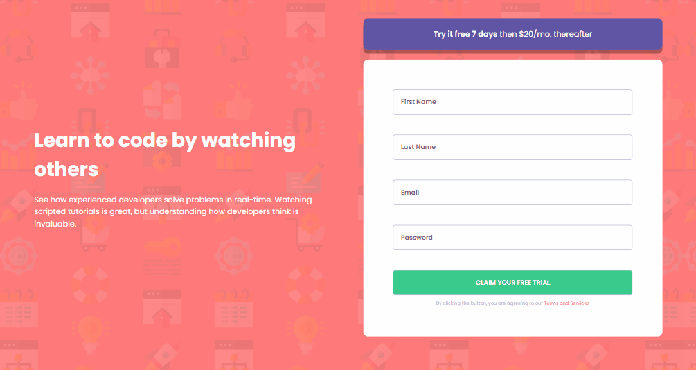

# Desafio Formulário de Inscrição - Frontend-Mentor

Este é um desafio de inscrição de formulário proposto pelo site Frontend-Mentor.

## Tabela de Conteúdos

- [Visão Geral](#visão-geral)
    - [Imagens](#imagens)
    - [Link da página](#link)
- [Processo](#processo)
    - [Linguagens utilizadas](#linguagens-utilizadas)
    - [O que aprendi](#o-que-aprendi)
    - [Possíveis evoluções](#possíveis-evoluções)
- [Autor](#autor)

## Visão-geral

### Imagens

<br>

````
Versão de Desktop
````

   

<br>

````
Versão Mobile
````

 

### Link

- Página no GitHub Pages: <a href="https://julio-mansan2.github.io/formulario-de-inscricao/">Clique aqui!</a>

## Processo

### Linguagens utilizadas

<br>

- Marcações semânticas de HTML5
- Propriedades de customização do CSS3
- Estruturas de JavaScript

<br>

### O que aprendi

<br>

- Evitar o resize no formulário, utilizando "z-index", ao invés de "display:none":

````css

.nao-preenchido {
    z-index: 1;
}

.preenchido {
    z-index: -1;
}

````

- Validar um formulário:

````html

<form class="formulario">
    <input type="text"  placeholder="First Name" required name="input" class="input">
    <span class="message-error preenchido">First Name cannot be empty</span>
    <input type="text" required placeholder="Last Name" name="" class="input">
    <span class="message-error preenchido">Last Name cannot be empty</span>
    <input type="email" required placeholder="Email" name="" class="input" id="email">
    <span class="message-error preenchido">Looks like this is not an email</span>
    <input type="password" required name="" placeholder="Password" class="input">
    <span class="message-error preenchido">Password cannot be empty</span>
    <input type="submit" id="submit" value="Claim your free trial">
    <p>By clicking the button, you are agreeing to our <a href="/">Terms and Services</a></p>
</form>

````
````javascript

inputSubmit.addEventListener ('click', () => 
    inputText.forEach(function (input, indice) {
    event.preventDefault()
    if (input.validity.valid === true) {            
        input.classList.add("valido")
        input.classList.remove("invalido")
        input.classList.remove('icon-error')
        mensagemDeErro[indice].classList.add("preenchido")
    } else {
        input.classList.remove("valido")
        input.classList.add('invalido')
        input.classList.add('icon-error')
        mensagemDeErro[indice].classList.remove('preenchido')
        mensagemDeErro[indice].classList.add("nao-preenchido")
    }
})
)


````
<br>

### Possíveis evoluções

<br>

- Estilizar o placeholder de um input;

<br>

## Autor

GitHub - <a href="https://github.com/julio-mansan2">julio-mansan2</a> <br>
Front-end Mentor - <a href="https://www.frontendmentor.io/profile/julio-mansan2">julio-mansan2</a> <br>
LinkedIn - <a href="https://www.linkedin.com/in/j%C3%BAlio-a-mansan-3415a7249/">Júlio A.</a> <br>